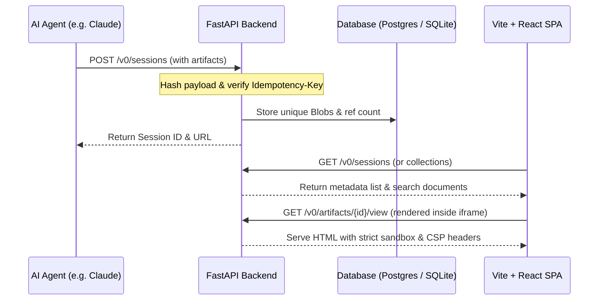

# Foundry &nbsp;

Foundry is a **session-centric artifact repository** designed specifically for AI coding agents. It enables agents to push high-fidelity coding artifacts (such as HTML, markdown, SVG/PNG, PDFs, JSON, and chat logs) via a simple REST API, while giving human developers a polished, responsive dashboard to browse, search, and securely view these artifacts.

---

## 🏗️ System Architecture & Layout

Foundry is organized as a decoupled monorepo:

```
foundry/
├── docs/                     # Specifications (v0 API contract, agent protocols)
├── backend/                  # Python + FastAPI + SQLModel backend service
│   ├── app/                  # Main application package (routers, auth, store, models)
│   └── smoke_test.py         # Integration & E2E smoke test suite
├── web/                      # React + Vite + TypeScript + Tailwind CSS v4 frontend
└── docker-compose.yml        # Docker compose environment for development/production
```

### Flow of Data


---

## 🚀 Getting Started

### Prerequisites
- [Docker](https://www.docker.com/) and Docker Compose
- Or Python >= 3.14 (with `uv`) and Node.js for running natively

### 1. Running the Full Stack (Docker Compose)
To spin up the entire production-like environment (Postgres database, FastAPI backend, and Nginx reverse proxy serving the frontend):
```bash
# Build and launch all services in detached mode
docker compose -p foundry-full -f docker-compose.full.yml up --build -d

# The web dashboard is accessible at: http://localhost:8080
```
*Note: Use `-p foundry-full` so it doesn't collide with any local dev docker projects.*

To seed the active stack with demo data:
```bash
docker compose -p foundry-full -f docker-compose.full.yml run --rm backend python seed.py http://localhost:8080
```

To tear down:
```bash
docker compose -p foundry-full -f docker-compose.full.yml down -v
```

### 2. Local Native Development
For a fast inner-loop dev experience with hot-reloading:
1. **Start Postgres** in the background:
   ```bash
   docker compose up -d
   ```
2. **Launch Backend**:
   ```bash
   cd backend
   cp .env.example .env
   uv run uvicorn app.main:app --reload  # API docs at http://localhost:8000/docs
   ```
3. **Launch Frontend**:
   ```bash
   cd web
   pnpm install
   pnpm run dev                          # Web dashboard at http://localhost:5173
   ```

---

## 🧪 Running Integration Tests

E2E and smoke tests verify endpoints, session deletion, blob garbage collection, collection pagination, search indexes, and visibility constraints.

Run the test suite inside an isolated Docker container using an ephemeral SQLite database:
```bash
docker compose -f docker-compose.full.yml run --build --rm backend sh -c "FOUNDRY_DATABASE_URL=sqlite:///./smoke.db python smoke_test.py"
```

---

## 🛡️ Key Architectural & Security Designs

### 1. Iframe Sandboxing & CSP
To prevent untrusted JavaScript executed inside agent-generated artifacts from hijacking sessions, stealing cookies, or reading local storage:
- High-fidelity visual artifacts are rendered inside a sandboxed `<iframe>` with strict browser directives.
- The `sandbox` attribute does *not* include `allow-same-origin`, forcing the iframe into a unique origin.
- The backend serves the view endpoint with a restrictive `Content-Security-Policy` header:
  ```http
  Content-Security-Policy: default-src 'none'; img-src data: blob: https:; style-src 'unsafe-inline'; font-src data:; script-src 'none' (or 'unsafe-inline' if allow_scripts is true)
  ```

### 2. Content-Addressed Blob Storage & GC
- Artifact bodies are decoupled from structural rows and stored in a shared `Blob` table, keyed by their SHA-256 hash. 
- Repeated pushes of unchanged files do not consume extra space: the backend increments a `ref_count` for each duplicate write.
- When an authorized request calls `DELETE /v0/sessions/{id}`, a reference-counting Garbage Collector (GC) runs:
  - It decrements `ref_count` for every referenced blob.
  - If a blob's `ref_count` drops to `0` or less, the blob record is deleted.
  - Removes associated artifacts, idempotency records, and deletes pins in any active collection.

---

## 📡 REST API v0 Endpoints

| Method | Path | Auth | Notes |
|:---|:---|:---:|:---|
| **GET** | `/v0/meta` | None | Capabilities & size limit discovery |
| **POST** | `/v0/sessions` | Bearer Key | Create session; honors `Idempotency-Key` |
| **POST** | `/v0/sessions/{id}/versions` | Bearer Key | Freeze current artifacts and snapshot a new version |
| **PATCH** | `/v0/sessions/{id}` | Bearer Key | Modify session metadata (title, tags, favorite) |
| **DELETE**| `/v0/sessions/{id}` | Bearer Key | Delete session and trigger Blob GC |
| **GET** | `/v0/sessions` | Cookie/Anon | List all visible sessions (supports FTS filter `?q=`) |
| **GET** | `/v0/sessions/{id}` | Cookie/Anon | View session detail (optional `?version=`) |
| **GET** | `/v0/artifacts/{id}` | Cookie/Anon | Retrieve raw artifact bytes |
| **GET** | `/v0/artifacts/{id}/view` | Cookie/Anon | Sandboxed rendering route for iframes |
| **GET** | `/v0/collections` | Cookie | List user-owned collections |
| **POST** | `/v0/collections` | Cookie | Create a dynamic collection (saved search) |
| **DELETE**| `/v0/collections/{id}` | Cookie | Delete a collection |
| **GET** | `/v0/collections/{id}/sessions` | Cookie | Resolve members (supports pagination `?limit=50&offset=0`) |
| **PUT** | `/v0/collections/{id}/sessions/{sid}` | Cookie | Manually pin a session to a collection |
| **DELETE**| `/v0/collections/{id}/sessions/{sid}` | Cookie | Unpin a session from a collection |
