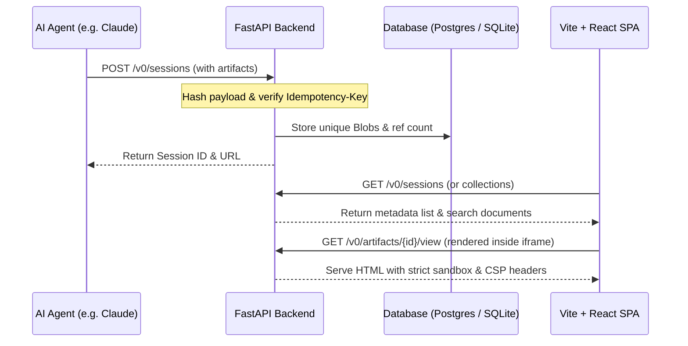

<div align="center">


# ArtifactBay

> **The persistent home for AI agent artifacts — store, search, showcase.**


</div>

ArtifactBay is a **session-centric artifact repository** designed specifically for AI coding agents. It enables agents to push high-fidelity coding artifacts (such as HTML, markdown, SVG/PNG, PDFs, JSON, and chat logs) via a simple REST API, while giving human developers a polished, responsive dashboard to browse, search, and securely view these artifacts.

**Why it exists:** agents increasingly emit rich, interactive HTML — diffs, dashboards, call graphs, slide decks — that markdown flattens and chat windows discard. ArtifactBay gives that output a durable address: pushed once, versioned automatically, searchable forever, and rendered safely.

> 💡 **Inspiration:** this project grew out of [*The Effectiveness of HTML*](https://thariqs.github.io/html-effectiveness/) by Thariq Shihipar. Reading it changed how I use agentic programming giving me the input to start let the agents produce output as rich HTML instead of flattened text. The issue was that all those beautiful outputs were lost somewhere in agents temporary storage so ArtifactBay is where those artifacts live and can be consulted.

## ✨ Features

- **MCP server** — register once per machine and every project can push *and search*. No per-project config, no staging directory, no env vars to plumb into each repo.
- **Agents can read back** — `search_artifacts` / `get_artifact` let an agent find what a past session already built instead of rebuilding it. This is the difference between an archive and usable memory.
- **Conversation provenance** — attach the transcript slice that produced an artifact. Stored **owner-only**, so a share link never ships the conversation behind the work.
- **One-command push** — `artifactbay push report.html`, or drop files in `.artifactbay/artifacts/`. Idempotent and fail-open (never blocks the agent).
- **Automatic versioning** — re-pushing snapshots a new version; nothing is overwritten. Artifacts can also be appended to the current version without a new snapshot.
- **Full-text search** — find sessions by title, content, agent, model, or tags.
- **Safe rendering** — untrusted HTML runs in a sandboxed, cross-origin `<iframe>` under a strict CSP; scripts are off unless explicitly opted in.
- **Content-addressed storage** — blobs deduped by SHA-256 with reference-counted garbage collection.
- **Capability links** — share a whole session *or a single artifact* via an unguessable secret URL. Viewers need no account, links are revocable, and shared links unfurl with a proper preview card in Slack/Discord/iMessage.
- **Standalone export** — pack anything into **one self-contained HTML file** that renders offline with no ArtifactBay, no account and no network. For presenting, emailing, or handing work to people outside the team.
- **Client-side redaction** — credential-shaped strings are stripped before anything leaves your machine.
- **Export** — download any version as a zip with a manifest. Your data comes back out.
- **Collections** — group sessions into saved searches or manual pins.
- **Agent integrations** — MCP server plus drop-in shims for Claude Code, Codex, Cursor, Aider, and OpenCode.

<div align="center">

</div>

---

## 🏗️ System Architecture & Layout

ArtifactBay is organized as a decoupled monorepo:

```
artifactbay/
├── docs/                     # Specifications (v0 API contract, agent protocols)
├── backend/                  # Python + FastAPI + SQLModel backend service
│   ├── app/                  # Main application package (routers, auth, store, models)
│   └── smoke_test.py         # Integration & E2E smoke test suite
├── web/                      # React + Vite + TypeScript + Tailwind CSS v4 frontend
└── docker-compose.yml        # Docker compose environment for development/production
```

### Flow of Data

```mermaid
sequenceDiagram
    participant Agent as AI Agent (e.g. Claude)
    participant API as FastAPI Backend
    participant DB as Database (Postgres / SQLite)
    participant UI as Vite + React SPA

    Agent->>API: POST /v0/sessions (with artifacts)
    note over API: Hash payload & verify Idempotency-Key
    API->>DB: Store unique Blobs & ref count
    API-->>Agent: Return Session ID & URL
    UI->>API: GET /v0/sessions (or collections)
    API-->>UI: Return metadata list & search documents
    UI->>API: GET /v0/artifacts/{id}/view (rendered inside iframe)
    API-->>UI: Serve HTML with strict sandbox & CSP headers
```

---

## 🚀 Getting Started

### Prerequisites
- [Docker](https://www.docker.com/) and Docker Compose
- Or Python >= 3.14 (with `uv`) and Node.js for running natively

### 1. Running the Full Stack (Docker Compose)
To spin up the entire production-like environment (Postgres database, FastAPI backend, and Nginx reverse proxy serving the frontend):
```bash
# Build and launch all services in detached mode
docker compose -p artifactbay-full -f docker-compose.full.yml up --build -d

# The web dashboard is accessible at: http://localhost:8080
```
*Note: Use `-p artifactbay-full` so it doesn't collide with any local dev docker projects.*

To seed the active stack with demo data:
```bash
docker compose -p artifactbay-full -f docker-compose.full.yml run --rm backend python seed.py http://localhost:8080
```

To tear down:
```bash
docker compose -p artifactbay-full -f docker-compose.full.yml down -v
```

### Self-Hosting From Prebuilt Images (no source checkout)
Every tagged release publishes multi-arch (amd64 + arm64) images to GHCR — `ghcr.io/sim186/artifactbay-backend` and `-web`. To deploy without cloning the repo:
```bash
# Grab the standalone compose file + env template
curl -O https://raw.githubusercontent.com/sim186/artifactbay/main/docker-compose.deploy.yml
curl -O https://raw.githubusercontent.com/sim186/artifactbay/main/.env.deploy.example

# Fill in secrets (the compose file refuses to start until they're set)
mv .env.deploy.example .env && $EDITOR .env

# Launch — pulls images, no build
docker compose -f docker-compose.deploy.yml up -d   # → http://localhost:8080
```
Pin a release with `ARTIFACTBAY_IMAGE_TAG=v1.2.3`; default is `:latest`. Put a TLS-terminating reverse proxy (Caddy, nginx, Traefik) in front and set `ARTIFACTBAY_BASE_URL` to your public `https://` host so share/artifact links resolve correctly.

### 2. Local Native Development
For a fast inner-loop dev experience with hot-reloading:
1. **Start Postgres** in the background:
   ```bash
   docker compose up -d
   ```
2. **Launch Backend**:
   ```bash
   cd backend
   cp .env.example .env
   uv run uvicorn app.main:app --reload  # API docs at http://localhost:8000/docs
   ```
3. **Launch Frontend**:
   ```bash
   cd web
   pnpm install
   pnpm run dev                          # Web dashboard at http://localhost:5173
   ```

---

## 🤖 Connecting Your Agents

Configure **once per machine**, not once per project.

```bash
# 1. Machine-wide config — writes ~/.config/artifactbay/config.json (chmod 600)
python3 integrations/artifactbay_cli.py init --url http://localhost:8080 --key ab_...

# 2. Register the MCP server with your agent (Claude Code shown; others in integrations/)
claude mcp add artifactbay --scope user -- python3 "$PWD/integrations/artifactbay_mcp.py"
```

That's it. Every project on the machine can now push and search — no `.artifactbay/`
setup, no environment variables, no shim committed to each repo.

The MCP server is stdlib-only (no `pip install`) and exposes both directions:

| Tool | What it does |
|:---|:---|
| `push_artifact` | Save inline content and get a URL; optionally attach a conversation slice |
| `push_files` | Save existing files or directories by path |
| `search_artifacts` | Full-text search over everything pushed before |
| `get_artifact` | Read a past artifact's content back |
| `list_sessions` / `get_session` | Browse history |
| `share` | Mint a capability link for a session or one artifact |

### Or use the CLI

For hooks, CI, shells and agents that don't speak MCP:

```bash
artifactbay push report.html architecture.svg --name "Database redesign"
artifactbay ls -q "ledger"        # search
artifactbay share <session-id>    # capability link (--artifact for a single file)
artifactbay doctor                # connectivity, auth, server capabilities
```

- **Paths are optional:** with none, it pushes whatever is in `.artifactbay/artifacts/`.
- **Idempotent & fail-open:** safe to call on every run; if ArtifactBay is unreachable the push is queued to `.artifactbay/pending/` and the agent never crashes.
- **Versioned:** the session id is remembered in `.artifactbay/session_id`, so a re-push becomes **v2** automatically.
- **Redacted:** credential-shaped strings are stripped before upload.

Per-agent shims live in [`integrations/`](integrations/):

| Agent | Preferred | Fallback |
|:---|:---|:---|
| **Claude Code** | MCP server | Skill `/artifactbay-push` (+ optional Stop hook) |
| **Codex CLI** | MCP server | `AGENTS.md` instruction → `artifactbay push` |
| **Cursor** | MCP server | `.cursor/rules` + VS Code task |
| **OpenCode** | MCP server | `/artifactbay` command |
| **Aider** | — | `post-commit` hook (auto-push on commit) |

### Presenting without ArtifactBay

A capability link still points at a running instance — no good on a conference-room
laptop with no network, in an email attachment, or for someone who should never touch
your server. `pack` builds **one self-contained HTML file** instead: artifacts inlined
(HTML into sandboxed `srcdoc`, images and PDFs as `data:` URIs), a tab bar, arrow-key
navigation, and zero network requests when opened.

```bash
# Pack a stored session
artifactbay pack <session-id> -o review.html

# …or pack local files with no instance involved at all
artifactbay pack --local report.html chart.svg notes.md --title "Q3 review" -o deck.html
```

From the UI, the **▤** button on a session downloads the same file. Agents get it as the
`pack_standalone` MCP tool, which can also pack content inline that was never pushed
anywhere.

Untrusted artifact HTML stays sandboxed inside the packed file — an `<iframe>` with no
`allow-same-origin`, and scripts only for artifacts explicitly marked `allow_scripts`.
Owner-only transcripts are included when *you* pack your own session and excluded when
the pack is produced through a share link.

### Conversation slices, not conversation archives

`push_artifact` accepts a `conversation` array: the few turns that produced the artifact.
It is stored as **owner-only** provenance — excluded from every capability link, public
view, export and search index — trimmed server-side (512 KB / 200 messages, newest kept),
and redacted before upload.

Storing *every* conversation from *every* agent is a deliberate non-goal. It has different
scale, retention and privacy needs than artifacts, and the content-addressed blob layer is
built for whole documents rather than append-only logs — an untrimmed transcript re-pushed
N times would store N ever-larger copies.

---

## 📡 API Reference (v0)

Interactive docs at `/docs`. Auth is either a `Bearer ab_...` API key (agents) or the
session cookie (web UI). `?t=<token>` is a capability token.

| Method | Path | Notes |
|:---|:---|:---|
| `GET` | `/v0/meta` | limits + `capabilities` list, so clients can detect an upgraded instance |
| `POST` | `/v0/sessions` | create; honours `Idempotency-Key` |
| `GET` | `/v0/sessions` | list/search — `q`, `agent`, `tag`, `project_id`, `favorite`, `limit`, `offset` |
| `GET` | `/v0/sessions/{id}` | detail (`?version=`, `?t=`) |
| `PATCH` `DELETE` | `/v0/sessions/{id}` | edit in place / delete with blob GC |
| `POST` | `/v0/sessions/{id}/versions` | snapshot a new version |
| `POST` | `/v0/sessions/{id}/artifacts` | **append to the current version** — no full re-upload |
| `GET` | `/v0/sessions/{id}/versions` | version history with timestamps, counts and sizes |
| `GET` | `/v0/sessions/{id}/export` | download a version as a zip + manifest |
| `GET` | `/v0/sessions/{id}/standalone` | **one self-contained HTML file** — renders offline, no ArtifactBay needed |
| `POST` `DELETE` | `/v0/sessions/{id}/share` | mint/rotate/revoke a session link |
| `GET` | `/v0/artifacts/{id}` `…/meta` `…/view` | raw bytes / metadata / sandboxed render |
| `POST` `DELETE` | `/v0/artifacts/{id}/share` | **per-artifact** capability link |
| `GET` | `/v0/artifacts/{id}/standalone` | that one artifact as a self-contained file |
| `DELETE` | `/v0/artifacts/{id}` | remove one artifact, release its blob |
| `GET` | `/v0/projects` `/v0/tags` | the vocabularies the list filters use |
| `GET` `POST` | `/v0/collections` | saved queries + manual pins |
| `PATCH` `DELETE` | `/v0/collections/{id}` | rename / edit query / delete |
| `GET` | `/v0/preview/s/{id}` `/v0/preview/a/{id}` | Open Graph cards for link unfurling |

## 🧪 Running Integration Tests

E2E and smoke tests verify endpoints, session deletion, blob garbage collection, collection pagination, search indexes, and visibility constraints.

Run the test suite inside an isolated Docker container using an ephemeral SQLite database:
```bash
docker compose -f docker-compose.full.yml run --build --rm backend sh -c "ARTIFACTBAY_DATABASE_URL=sqlite:///./smoke.db python smoke_test.py"
```

---

## 🛡️ Key Architectural & Security Designs

### 1. Iframe Sandboxing & CSP
To prevent untrusted JavaScript executed inside agent-generated artifacts from hijacking sessions, stealing cookies, or reading local storage:
- High-fidelity visual artifacts are rendered inside a sandboxed `<iframe>` with strict browser directives.
- The `sandbox` attribute does *not* include `allow-same-origin`, forcing the iframe into a unique origin.
- The backend serves the view endpoint with a restrictive `Content-Security-Policy` header:
  ```http
  Content-Security-Policy: default-src 'none'; img-src data: blob: https:; style-src 'unsafe-inline'; font-src data:; script-src 'none' (or 'unsafe-inline' if allow_scripts is true)
  ```

### 2. Content-Addressed Blob Storage & GC
- Artifact bodies are decoupled from structural rows and stored in a shared `Blob` table, keyed by their SHA-256 hash. 
- Repeated pushes of unchanged files do not consume extra space: the backend increments a `ref_count` for each duplicate write.
- When an authorized request calls `DELETE /v0/sessions/{id}`, a reference-counting Garbage Collector (GC) runs:
  - It decrements `ref_count` for every referenced blob.
  - If a blob's `ref_count` drops to `0` or less, the blob record is deleted.
  - Removes associated artifacts, idempotency records, and deletes pins in any active collection.

### 3. Capability Links (Viewer-Only Sharing)
To let people view a private session without giving them an account:
- `POST /v0/sessions/{id}/share` mints an unguessable token (`secrets.token_urlsafe(32)`) stored on the session; the share URL is `/s/{id}?t=<token>`.
- The token grants anonymous **read** of that one session (all versions + artifacts), independent of `visibility`. It never appears in list queries, so link-shared sessions stay unlisted.
- `POST /v0/artifacts/{id}/share` does the same for a **single artifact**, so "look at this dashboard" doesn't require exposing the whole session. An artifact token unlocks exactly that artifact — not its session, not its siblings.
- Token checks use a constant-time compare and return `404` (not `403`) on mismatch, so existence isn't leaked. Read endpoints serve artifacts with `Referrer-Policy: no-referrer` to keep the token out of outbound referrers.
- `DELETE …/share` (or `POST …/share?rotate=1`) revokes/rolls the link immediately.

### 4. Ownership and Owner-Only Artifacts
- Sessions carry an `owner_id`. A member's API key can only read, mutate or list its own sessions; admins see everything. (Rows written before ownership existed stay readable by any authenticated principal, so upgrades don't hide anyone's history from them.)
- Artifacts can be marked `owner_only`. Conversation slices default to it, and such artifacts are withheld from anonymous readers *however the session was reached* — share link, public visibility, export, version listing or direct id. Their bodies are also kept out of the shared search document, since `ts_headline` would otherwise quote fragments back to anonymous searchers.

### 5. Trustworthy Links Behind a Proxy
Outbound URLs are derived per request from `X-Forwarded-Proto`/`X-Forwarded-Host` (set by the bundled nginx), falling back to `ARTIFACTBAY_BASE_URL`. One instance reached over several hostnames mints links that work for the client that asked. Set `ARTIFACTBAY_TRUST_FORWARDED_HOST=false` if the app is exposed directly to the internet, where clients can forge those headers.

Link-preview crawlers (Slack, Discord, iMessage, …) can't run JavaScript, so nginx routes them to a server-rendered Open Graph card while humans get the SPA. A crawler without a valid token gets a generic card that reveals nothing about a private session.

---

## 📡 REST API v0 Endpoints

| Method | Path | Auth | Notes |
|:---|:---|:---:|:---|
| **GET** | `/v0/meta` | None | Capabilities & size limit discovery |
| **POST** | `/v0/sessions` | Bearer Key | Create session; honors `Idempotency-Key` |
| **POST** | `/v0/sessions/{id}/versions` | Bearer Key | Freeze current artifacts and snapshot a new version |
| **PATCH** | `/v0/sessions/{id}` | Bearer Key | Modify session metadata (title, tags, favorite) |
| **DELETE**| `/v0/sessions/{id}` | Bearer Key | Delete session and trigger Blob GC |
| **POST** | `/v0/sessions/{id}/share` | Bearer Key | Mint a capability link (`?rotate=1` to roll the token) |
| **DELETE**| `/v0/sessions/{id}/share` | Bearer Key | Revoke the capability link |
| **GET** | `/v0/sessions` | Cookie/Anon | List all visible sessions (supports FTS filter `?q=`) |
| **GET** | `/v0/sessions/{id}` | Cookie/Anon | View session detail (optional `?version=`) |
| **GET** | `/v0/artifacts/{id}` | Cookie/Anon | Retrieve raw artifact bytes |
| **GET** | `/v0/artifacts/{id}/view` | Cookie/Anon | Sandboxed rendering route for iframes |
| **GET** | `/v0/collections` | Cookie | List user-owned collections |
| **POST** | `/v0/collections` | Cookie | Create a dynamic collection (saved search) |
| **DELETE**| `/v0/collections/{id}` | Cookie | Delete a collection |
| **GET** | `/v0/collections/{id}/sessions` | Cookie | Resolve members (supports pagination `?limit=50&offset=0`) |
| **PUT** | `/v0/collections/{id}/sessions/{sid}` | Cookie | Manually pin a session to a collection |
| **DELETE**| `/v0/collections/{id}/sessions/{sid}` | Cookie | Unpin a session from a collection |
